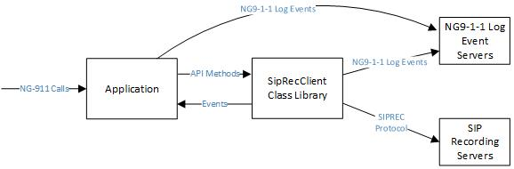

# Introduction
The SipRecClient class library is a .NET DLL that Next Generation 9-1-1 (NG9-1-1) applications can use to record multimedia NG9-1-1 calls. Applications that use the [SipLib](https://github.com/PhrSite/SipLib) and the [Ng911Lib](https://github.com/PhrSite/Ng911Lib) class libraries can use this class library. The following block diagram shows the relationship between the SipRecClient class library, the NG9-1-1 application, SIP Recording Server(s) (SRS) and NG9-1-1 Log Event Servers.



Applications that anchor the media of NG9-1-1 multimedia calls can use this class library. This class library supports audio, video, Real Time Text (RTT) and Message Session Relay Protocol (MSRP) text media.

# Documentation
The documentation pages project for this project is called [SipRecClient](https://phrsite.github.io/SipRecClient). The documentation web site includes class documentation and articles that explain usage of the classes in this library.

# External Dependancies

| NuGet Package | GitHub Project | GitHub Document Pages | Description |
|--------|--------|-------|------|
| SipLib       | [SipLib](https://github.com/PhrSite/SipLib) | https://phrsite.github.io/SipLib | .NET Session Initiation Protocol (SIP) protocol class library for SIP and protocol extentions for Next Generation 9-1-1 (NG9-1-1) applications |
| Ng911Lib     | [Ng911Lib](https://github.com/PhrSite/Ng911Lib) | https://phrsite.github.io/Ng911Lib | .NET NG9-1-1 class library that provides C# classes for all of the XML and JSON schemas used by NG9-1-1 applications |

# Installation
This class library is available on NuGet.

To install it from the .NET CLI type:

```
dotnet add package SipRecClient --version 0.0.1
```

To install using the NuGET Package Manager Command window type:

```
NuGet\Install-Package SipRecClient -Version x.x.x
```
Or, you can install it from the Visual Studio GUI.

1. Right click on the project
2. Select Manage NuGet Packages
3. Search for SipRecClient
4. Click on Install

# Project Structure

## Class Library Directory
This directory contains the source code and the Visual Studio 2022 solution and project files.

## Documentation Directory
This directory contains the DOCFX configuration files, documentation markdown source files and other files required to generate the on-line documentation web pages.
## docs Directory
The docs directory contains HTML and other generated files generated by DOCFX.
## Documents Directory
This directory contains supporting documents.
